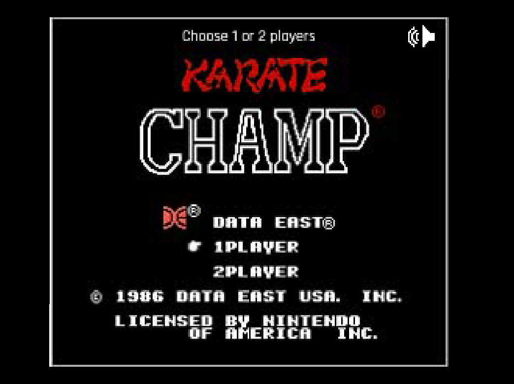

# Karate Champ Phaser 3

## Description

Phaser 3 version of the Arcade Game "Karate Champ"

# Features

-   Webpack 4
-   babel 7 +
-   Es6 support
-   Prettier Style
-   Easy deployment to gh-pages
-   Webpack bundle analyzer
-   Howler 2 for Audio
-   Browsersync
-   Project Complexity analysis `yarn complexity-report`
-   Tilemap processing (extrusion and minification and more)
-   Image processing (moving and compression with pngquant)
-   Audio processing (Audiosprite Creation)

# Installation

1.  Clone the repo
2.  `yarn install`
3.  `yarn start`

## Game Play

Practice Board

- Use this board to practice moves (no direction or guidance provided)

Training Boaard

- Use this board for guided training and to increase belt ranking

Challenge Board

- Boards provided during gameplay between matches to test your skill

Game Board

- Either single or multi-player matches (location will radomly change)

### Player Movement

- back kick = right stick left
- round kick = right stik up
- front kick = right stick right
- low kick = right stick down
- front leg sweep = left stick down, right stick right
- back leg sweep = left stick down, right stick left
- spinning heal kick = left stick right, right stick left
- flying side kick = left stick up, right stick right
- front flip = left stick up, right stick down
- back flip = left stick down, right stick up
- move forward = left stick right
- move backward = left stick left
- jump = left stick up
- squat = left stick down
- reverse punch = left shoulder + right stick right
- squating reverse punch = left shoulder + right stick down
- thrust punch = left stick right + right stick right
- (new) back fist = left shoulder + right stick right
- (new) spinning back fist = left shoulder + left stick left + right stick right
- high block = left shoulder + left stick up
- middle block = left shoulder + left stick back
- low block = left shoulder + left stick down
- change direction = right shoulder